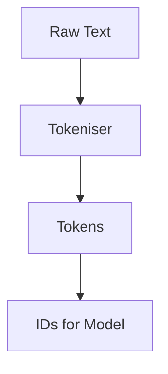

# Why Tokenisation Is the Hidden Engine of LLMs 🚂

## Introduction: The Magic Behind the Words ✨

When you interact with a large language model (LLM) like ChatGPT, have you ever wondered how it understands and generates text? The secret sauce is *tokenisation*—a process that quietly powers everything from your search queries to AI-generated poetry. In this post, we'll explore why tokenisation is the hidden engine of LLMs, how it works, and why it matters for the future of AI.

## What Is Tokenisation? 🧩

Tokenisation is the process of breaking down text into smaller units called *tokens*. These tokens can be as short as a single character or as long as a word or phrase. For example, the sentence:

> "The cat sat on the mat."

might be tokenised as:

```
['The', 'cat', 'sat', 'on', 'the', 'mat', '.']
```

But in practice, LLMs often use subword units, so "cat" might become ["c", "at"].

## Why Not Just Use Words? 🤔

Languages are complex! There are new words, typos, slang, and even emojis. If an LLM only used whole words, it would need to memorize millions of them. Subword tokenisation (like Byte-Pair Encoding or WordPiece) lets models handle rare or new words by breaking them into known pieces. This makes LLMs more flexible and robust.

## How Tokenisation Powers LLMs ⚡

1. **Efficient Input:** Tokenisation turns messy human language into a format LLMs can process—numbers!
2. **Vocabulary Control:** By limiting the number of tokens, models stay efficient and avoid memory overload.
3. **Generalisation:** Subword tokens help models understand new words by their parts (e.g., "unhappiness" = "un" + "happiness").

## A Simple Diagram: Tokenisation Pipeline



## Real-World Example: Why It Matters 🏆

Imagine you type a typo like "bananna" instead of "banana". Thanks to subword tokenisation, the model can still make sense of it by splitting it into familiar parts. This is why LLMs are so good at handling the unexpected!

## Tokenisation and Model Performance 📈

Better tokenisation means:
- Faster training
- Smaller models
- More accurate predictions

It's not just a technical detail—it's a key reason LLMs have become so powerful.

## The Future: Smarter, Multilingual Models 🌍

Tokenisation is evolving. New methods like SentencePiece and Unigram are making models even better at handling multiple languages and scripts. The next generation of LLMs will rely on even smarter tokenisation to understand the world's diversity.

## Call to Action 🚀

Next time you use an AI tool, remember the hidden engine—tokenisation! If you're building with LLMs, experiment with different tokenisers and see how they affect your results. Have questions or want to share your experience? Tweet at me or leave a comment below!

---
